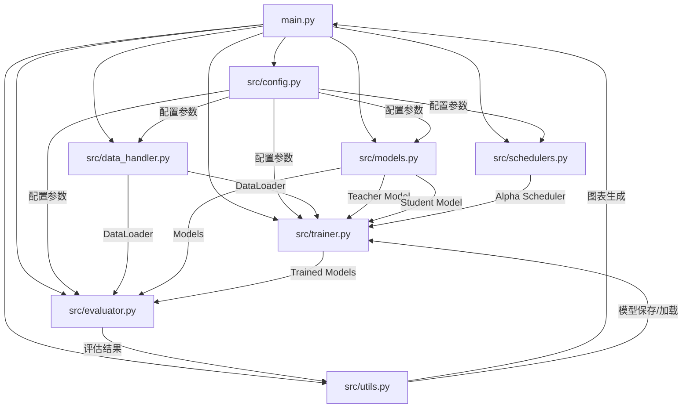
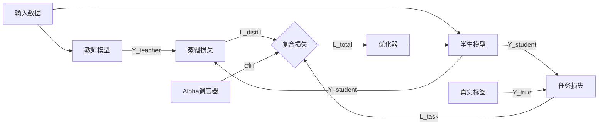
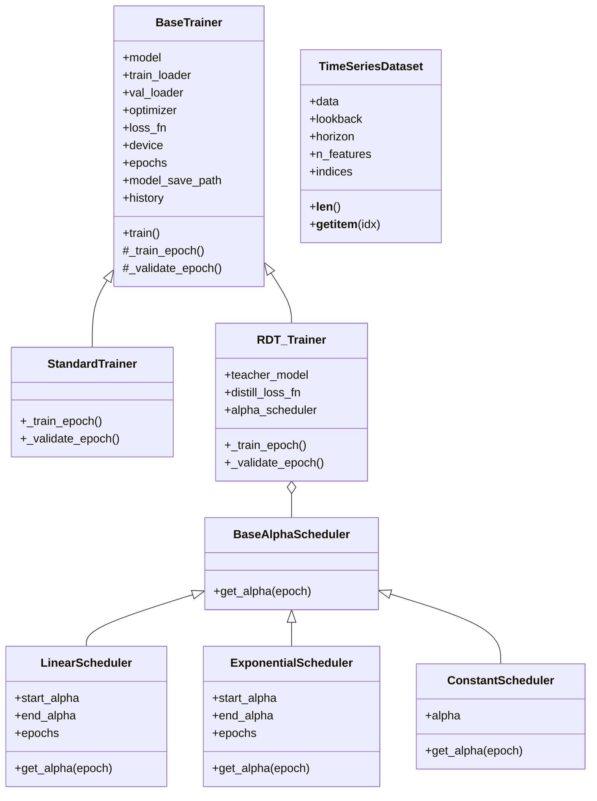
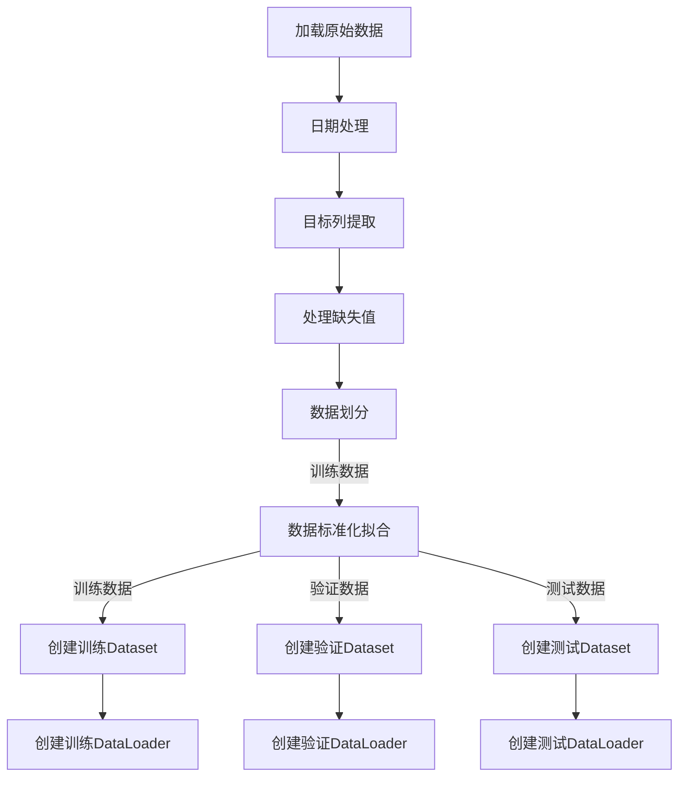
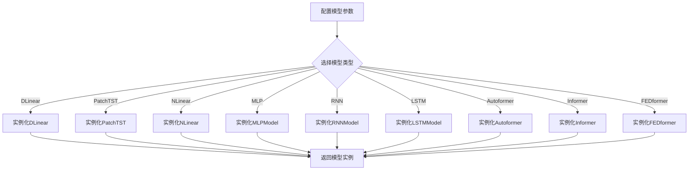

# RDT 架构文档

本文档使用图表和说明来描述RDT时间序列预测验证框架的架构设计和组件关系。

## 1. 系统组件关系图



## 2. RDT训练数据流图



## 3. 核心类图



## 4. 数据处理流程



## 5. 模型实例化流程



## 6. 评估流程

```mermaid
flowchart TD
    A[加载模型] --> B[在测试集上评估]
    B --> C[计算MSE/MAE等指标]
    B --> D[生成预测vs真实值图表]
    C --> E[输出性能报告]
    D --> E
    
    B --> F[添加噪声进行鲁棒性测试]
    F --> G[不同噪声级别下计算指标]
    G --> H[生成鲁棒性曲线]
    H --> E
    
    A --> I[多次运行]
    I --> J[收集多次运行指标]
    J --> K[生成稳定性分析图表]
    K --> E